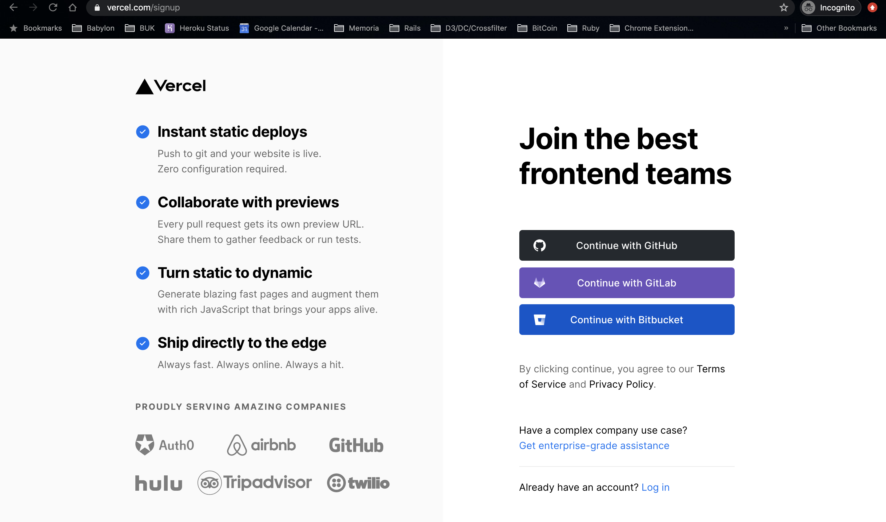
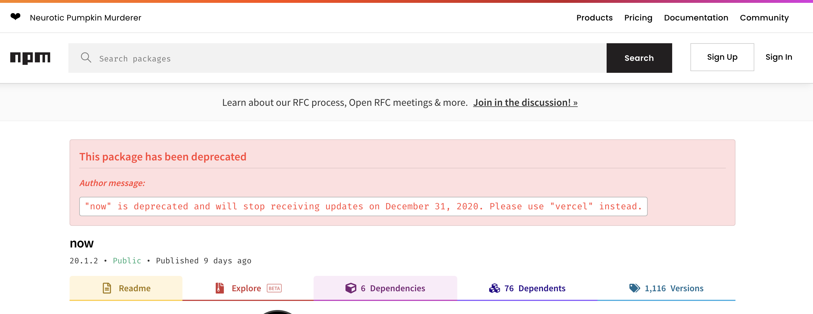
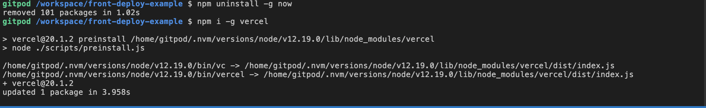
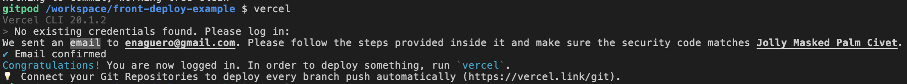
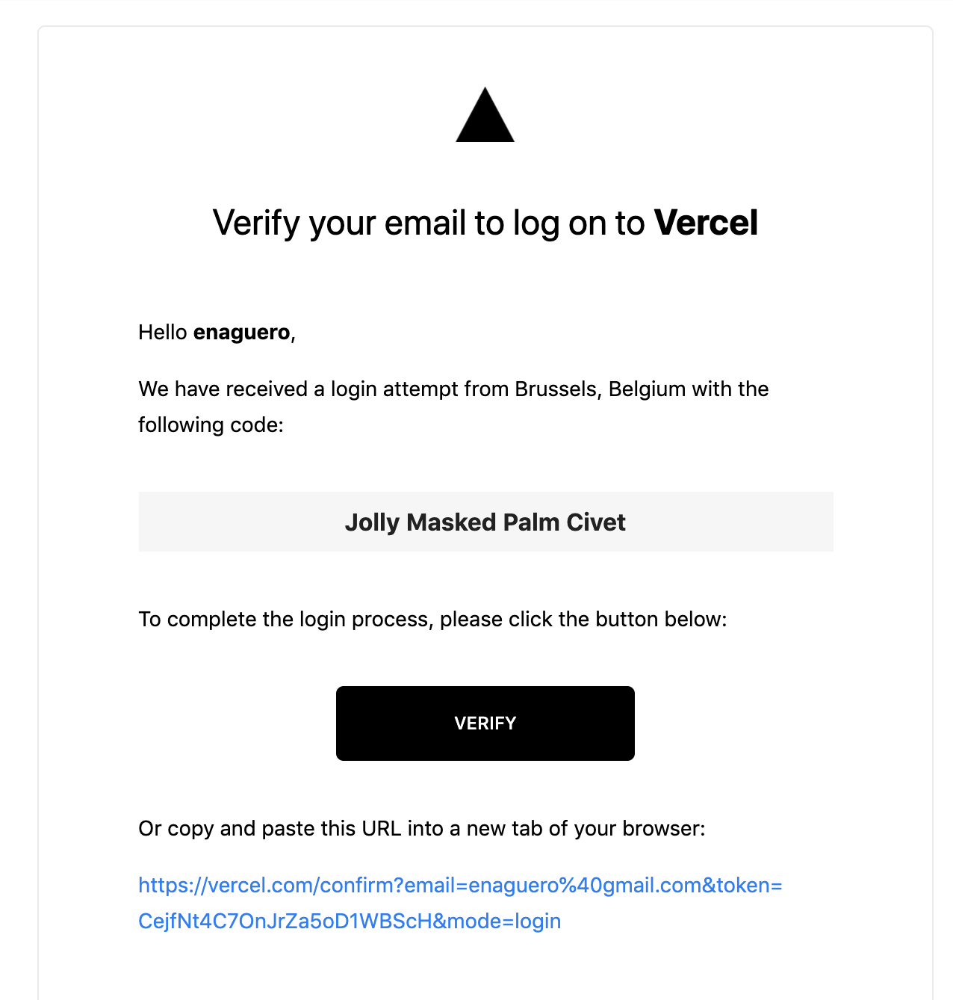
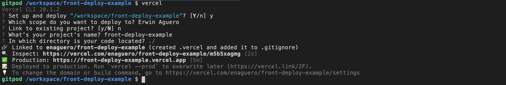
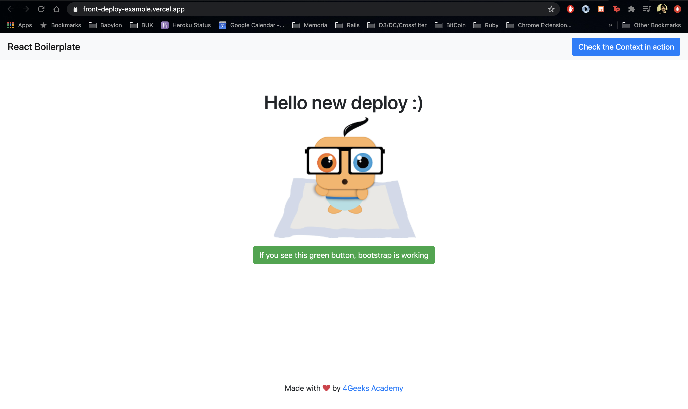
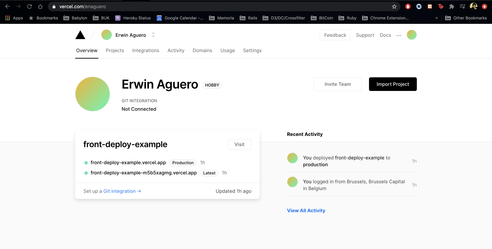
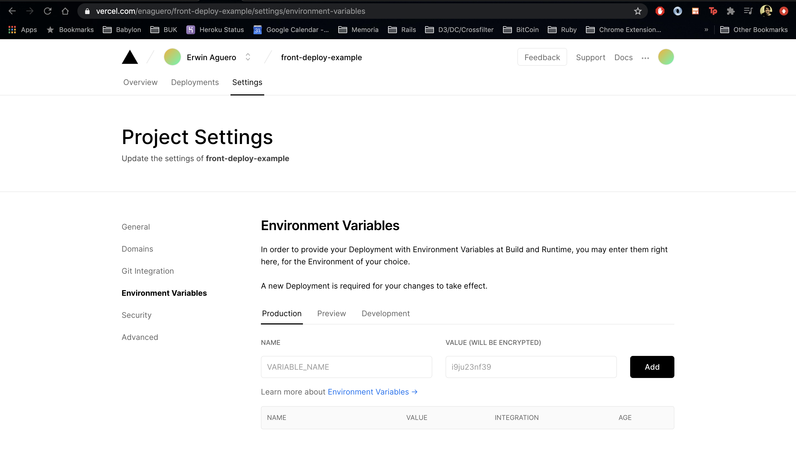

# front_end_deployment_instructions
Instrucciones para hacer deploy de una aplicación hecha con [React boiler plate de 4GeeksAcademy](https://github.com/4GeeksAcademy/react-hello-webapp).

## Crear una cuenta en http://zeit.co/

Pasaron de llamarse [Zeit](http://zeit.co/) a [Vercel](https://vercel.com/). Debes registrarte simplemente en su [página de registro](https://vercel.com/signup) y puedes asociar tu cuenta GitHub para una mejor integración.



## Prepara tu boiler plate : Instalación de Vercle CLI

Zeit a cambiado de now a vercel, por eso debemos realizar esta actualización.



### Remover now cli e instalar vercel cli

Desde la terminal de GitPod puedes ejecutar los siguientes comandos:

```
$ npm uninstall -g now
$ npm i -g vercel
```

Básicamente, indicas desintalar now e instala vercel.



### Asocia tu cuenta Vercel en la terminal

Debemos indicarle al proyecto que se publique el código en nuestro workspace de Vercel (alias proyecto). Desde la terminal ejecuta simplemente vercel:

```
$ vercel
``` 

Resultado:


Recibirás un email indicando que necesitan verificar tu correo electrónico, debes simplemente poner "Verify" en el correo. **Acá es importante que hayas usado tu cuenta GitHub para recibir correctamente este correo.** 



## Deploy

### Genera el código

Para generar el código de producción se utiliza el siguiente comando desde tu terminal de GitPod:

```
$ npm run build
```

Este comando esta descrito en el archivo [package.json](https://github.com/4GeeksAcademy/react-hello-webapp/blob/master/package.json#L11) del boiler plate. Se indica que se desea correo webpack con un archivo de configuración en modo producción, más información [aquí](https://webpack.js.org/api/cli/#with-configuration-file).

Esto genera el contenido de la carpeta `public`, que es lo que vamos a usar como archivos para el hosting en vercel.

### Publica en vercel

Solo debes ejecutar el comando vercel e introducir las configuraciones que desees, las que vienen por defecto, son bastante buenas :).

```
$ vercel
```

Resultado:


Repositorio: https://github.com/enaguero/front-deploy-example
Link a página: https://front-deploy-example-m5b5xagmg.vercel.app/

**¿Por qué fue tan fácil?** El boiler plate viene con un archivo de configuración llamado [`now.json`](https://github.com/4GeeksAcademy/react-hello-webapp/blob/master/now.json), este archivo es leído por vercel para realizar el proceso copiar los archivos en `public` al servidor de ellos.

Resultado:



## Variables de entorno

### ¿Qué son?

Básicamente son variable que utiliza el sistema operativo (LINUX, Windows, Mac OS u otros) para poder guardar valores secretos en un interior y sin que otros sistemas pueden conocer su contenido. [Más info](https://www.genbeta.com/desarrollo/variables-entorno-que-sirven-como-podemos-editarlas-windows-linux).

### ¿Cómo configurarlas en Vercel?

Debes realizar al menos un deploy (el proceso que realizamos antes) para tener un proyecto en el dashboard de la página de vercel.com, se verá algo así:



Dentro de tu proyecto (simplemente haciendo click accedes), podrás a acceder a "Settings", luego "Environment Variables" y podrás agregar las que desees :). Acá debes incorporar los token a las API que usaste en tu proyecto:



